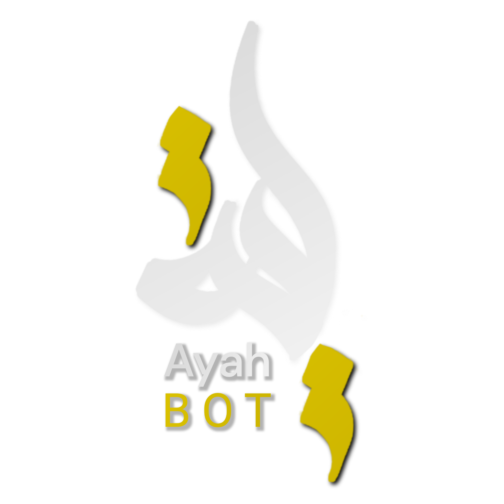

***

  

  
  

***

 <i>"Convey from me, even a single verse."</i>
 
- Sahih al-Bukhari 3461

***

* [Features](#features)
* [Purpose & General Info](#philosophy)
* [Commands](#commands)
* [Deploying](#deploying)
* [Contributing](#contributing)

## Features

* Schedule daily ayah according to your timezone
* Get all the translations from [Quran.com](https://quran.com)
* Access to the codebase
* Custom Instance Deployable
* and many other commands you'll find useful.
* Actively maintained

## Philosophy

In our daily, techies spend their time mostly in the internet, sometimes, for works and sometimes wasting the time. Sometimes we feel that there is a need of something that will give you an ayah daily to keep you up with your your faith in islam and get more stronger in your faith. AyahBot's main purpose is to give you a handy solution to reminding you with a quran ayah everyday at your convenient time. Developers at AyahBot team made it open-source for the easier and fast development of the bot. That's why, you can also check the code and make sure that we are not doing anything with your information.

In Shaa Allah, AyahBot will help you greatly in your trying to understanding al-quran's meaning on a regular basis. We request you to keep us in your dua.

## Commands

As a discord bot, AyahBot also its own commands for making your tasks easier. They are for various purposes, from scheduling to even printing any ayah from quran. You can learn more about these commands in our [wiki](https://github.com/AyahBot-Dev/AyahBot-Discord/wiki/Commands) page. They are clearly given there with proper instructions of how to use them.

## Deploying

As AyahBot is open-source, you can also deploy your own instance of AyahBot. It's pretty easy to deploy another instance of AyahBot. If you want to get started now, then check out our [wiki page]() now.

*N.B.: You can start your own instance of AyahBot freely, but you are requested not to try to impersonate the AyahBot with your private instance without our prior permission.*

## Contributing

Mostly, development of AyahBot requires help of many others and that's why the bot is open-source. If you want to help in the development and gain some thawab, you can regularly check the [issues](https://github.com/AyahBot-Dev/AyahBot-Discord/issues) page and help solve the issues.

*If you have any major suggestions or major issues that needs discussion with us, you can contact us at `AyahBot Dev#9646` (Discord)*
